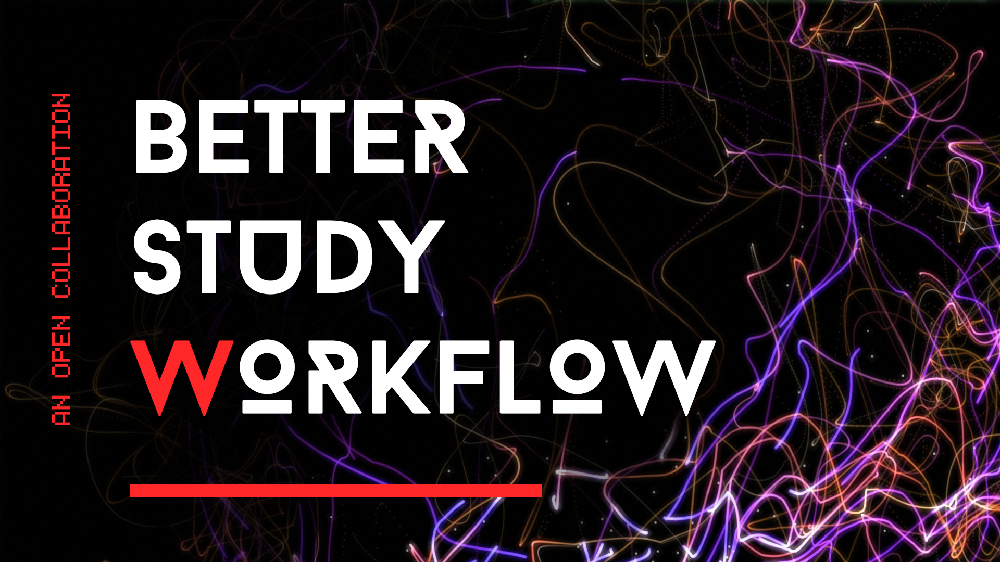

## Intro

This repository is dedicated to the ongoing pursuit of an optimized study workflow.
Harnessing the collaborative power of people, science, and the latest technology and tools, let's endeavor to create a better, more efficient way to study and become better learners. The workflow is primarily centered around the [Obsidian](https://obsidian.md/) software and tailored to tech-savvy people; any brave soul can implement it or use it to improve their own workflow.

## Contributing

Contributions and discussions are welcome and encouraged! Please read the [contribution guidelines](CONTRIBUTING.md) first.

## Table of Contents

- The [Theory](Theory/) folder contains the latest research and ideas behind learning.
- The [Tools](Tools/) folder contains all the tools that can be used to create a better study workflow.
- The [Workflow](Workflow/) folder contains the actual study workflow utilizing the tools from the *Tools* folder.

