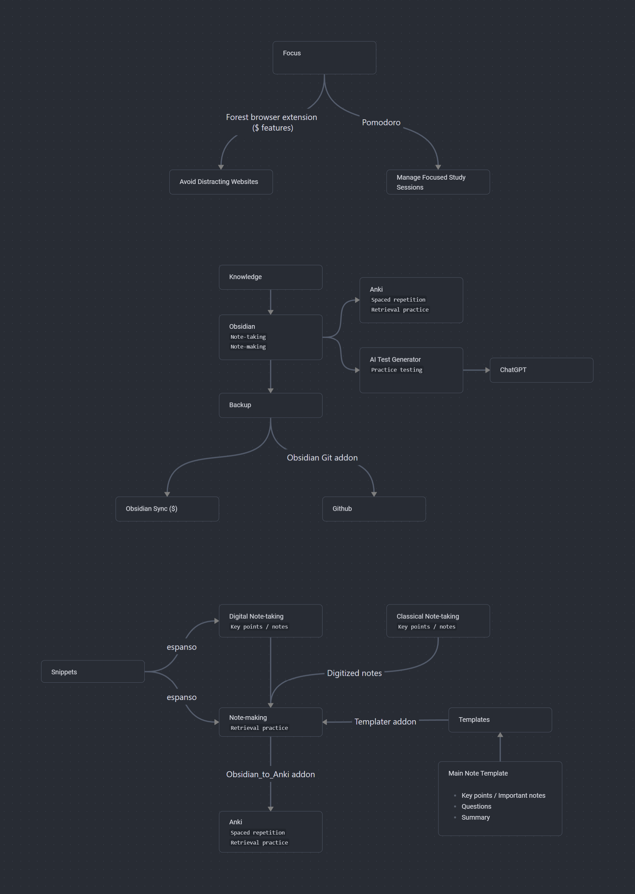

# Better Study Workflow

The workflow file is an Obsidian canvas file and can be found in the [Workflow](Workflow/) folder named "Better Study Workflow.canvas".

- Ensure focus and balance it with diffuse thinking
    - [Theory](../Theory/thinking-modes.md)
    - Use the tools [Forest](../Tools/forest.md) and [Pomodoro](../Tools/pomodoro.md)

- Take notes
    - [Theory](../Theory/key-techniques.md)
    - Use the tool [Obsidian](../Tools/obsidian.md#note-taking)

- Centralize all the knowledge in Obsidian

- Write down key points and important concepts when taking notes
    - [Theory](../Theory/key-techniques.md)
    - Use the tool [Obsidian](../Tools/obsidian.md) to take notes
    - or digitize your notes and add them to Obsidian

- Add questions and summaries later when making notes
- Questions can be turned into [Anki](../Tools/anki.md) cards
   - [Theory](../Theory/key-techniques.md#retrieval-practice)
   - Use [espanso](../Tools/espanso.md) to quickly add anki cards snippets in Obsidian
   - Anki card templates can be found in the [Templates](../Templates) folder
   - Anki cards from Obsidian can be exported to Anki by using the *Obsidian_to_Anki addon* for Obsidian

- Use any AI tool like ChatGPT for practice testing
    - [Theory](../Theory/key-techniques.md#practice-testing)

- Backup your Obsidian vault
    - by using Obsidian sync, a paid service
    - or use a git repository by using the *Obsidian Git addon* for Obsidian
    - if you're storing a sizable amounts of larger files, it might be a good idea to use a cloud storage service like Google Drive or Dropbox with an *Attachments* folder in your Obsidian vault
    - alternatively, you can just make local backups of your vault

